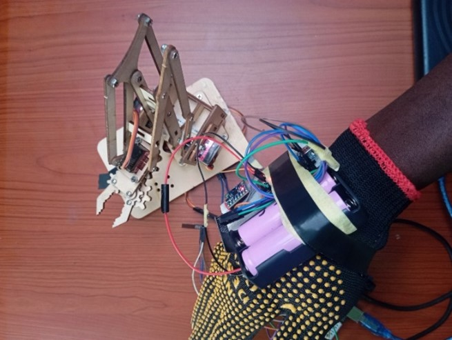

# Hand Gesture Controlled 4-DOF Robotic Arm

> A wearable glove controller that maps real-time hand gestures to wireless commands for a 4-degree-of-freedom servo robotic arm no buttons, no joysticks, just natural hand motion.

---

## Demo



*Glove controller (right) communicating wirelessly with the 4-DOF robotic arm (left). Built during SIWES at Hub360 Circuits Ltd, Abuja.*

---

## Project Overview

This project was developed during **SIWES (Students' Industrial Work Experience Scheme)** at **Hub360 Circuits Ltd, Abuja, Nigeria**.

The system uses an **MPU6050 IMU** mounted on a wearable glove to detect hand tilt, lift, and wrist-twist gestures. An **Arduino Nano** classifies these gestures in real time and transmits single-character command tokens to an **ESP-01 Wi-Fi module**, which relays them wirelessly to the robotic arm receiver. The arm's four servo-driven joints base, shoulder, elbow, and gripper respond directly to operator hand movements.

The control firmware uses two complementary MPU6050 libraries simultaneously: one for raw accelerometer readings (tilt detection) and another for fused angle computation (gyro-integrated yaw for gripper control). A 5-sample moving average filter reduces noise on the elbow axis.

---

## Objectives

- Design a wearable, wireless gesture interface requiring no physical buttons or joysticks
- Map four distinct hand gestures to four independent robotic arm DOFs
- Implement sensor fusion (accelerometer + gyroscope) for reliable, drift-resistant gesture detection
- Apply a digital noise filter to improve elbow joint control stability
- Demonstrate wireless telemetry between glove and arm using ESP-01 over Wi-Fi

---

## 🏗️ System Architecture

```
┌─────────────────────────────────────────────────────────────────────┐
│  GLOVE UNIT                                                         │
│                                                                     │
│  MPU6050 ──I2C──► Arduino Nano        ──SoftwareSerial──► ESP-01    │
│  (IMU)             (Glove_Arm.ino)                        (Glove_   │
│                    Reads accel/gyro                        Esp01)   │
│                    Classifies gesture                    Wi-Fi STA  │
│                    Sends char A–H                        (client)   │
└──────────────────────────────────────────────┬──────────────────────┘
                                               │ Wi-Fi TCP
                                               ▼
┌─────────────────────────────────────────────────────────────────────┐
│  ARM UNIT                                                           │
│                                                                     │
│  ESP-01        ──SoftwareSerial──► Arduino Nano ──PWM──► SG90 ×4    │
│  (Arm_Esp01)                       (Arm_Nano)     Base / Shoulder   │
│  Wi-Fi AP                          Parses A–H     Elbow / Gripper   │
│  (server)                          Drives servos                    │
└─────────────────────────────────────────────────────────────────────┘
```

### Gesture → Command Map

| Hand Gesture | Axis Detected | Command | Arm Action |
|---|---|---|---|
| Tilt wrist forward | Accel Y > +5 m/s² | `C` | Shoulder UP |
| Tilt wrist backward | Accel Y < −5 m/s² | `D` | Shoulder DOWN |
| Lean hand left | Accel X < −5 m/s² | `A` | Base rotate LEFT |
| Lean hand right | Accel X > +7 m/s² | `B` | Base rotate RIGHT |
| Lift palm upward | Accel Z > +10 m/s² | `E` | Elbow UP |
| Lower palm downward | Accel Z < −8 m/s² | `F` | Elbow DOWN |
| Twist wrist CW | Yaw angle > +20° | `G` | Gripper OPEN |
| Twist wrist CCW | Yaw angle < −15° | `H` | Gripper CLOSE |
| Neutral / resting | Within dead zone | *(none)* | STOP |

---

## Components & Hardware

| Component | Qty | Purpose |
|---|---|---|
| Arduino Nano (ATmega328P) | 2 | Glove controller + Arm receiver |
| MPU6050 IMU | 1 | 6-axis accelerometer + gyroscope on glove |
| ESP-01 Wi-Fi Module | 2 | Wireless command link (TX on glove, RX on arm) |
| SG90 Servo Motor | 4 | Base, shoulder, elbow, gripper joints |
| 4-DOF Robotic Arm Kit | 1 | Laser-cut wooden frame with servo mounts |
| 18650 Li-ion Battery × 2 | 2 set | Power supply for glove & Arm electronics |
| Tactile glove | 1 | Mounting platform for electronics |
| Jumper wires, breadboard | — | Wiring and prototyping |

---

## Firmware Structure

```
gesture-controlled-robotic-arm/
├── glove_controller/
│   ├── Glove_Arm.ino         ← Nano on glove: reads MPU6050, classifies gestures
│   └── Glove_Esp01.ino       ← ESP-01 on glove: Wi-Fi client, forwards commands
├── arm_receiver/
│   ├── Arm_Nano.ino          ← Nano on arm: receives commands, drives servos
│   └── Arm_Esp01.ino         ← ESP-01 on arm: Wi-Fi AP, bridges to arm Nano
├── diagrams/
│   ├── system_block_diagram.png
│   └── wiring_diagram.png
├── media/
│   └── demo.jpg
└── README.md
```

### Library Dependencies

Install via Arduino IDE Library Manager:

| Library | Purpose |
|---|---|
| `Adafruit MPU6050` | Raw accelerometer + gyroscope readings |
| `Adafruit Unified Sensor` | Dependency for Adafruit MPU6050 |
| `MPU6050_light` | Fused angle (yaw/roll/pitch) calculations |

---

## How It Works — Step by Step

1. **Power-on calibration:** On startup, the Nano prompts the operator to hold the glove still for ~2 seconds while gyro offsets are calculated. This is essential for accurate yaw (wrist twist) detection.

2. **Dual-library IMU reading:** Every 50ms, the loop reads raw accelerometer values (Adafruit library) and updates fused angles (MPU6050_light). Both are needed: raw accel for tilt gestures, integrated angles for wrist-twist detection.

3. **Moving average filter:** The Z-axis reading (elbow control) passes through a 5-sample circular buffer before threshold comparison, smoothing out hand vibration noise.

4. **Gesture classification:** A priority-ordered set of threshold comparisons maps the current sensor state to one of 8 commands. Only one DOF is active at a time the highest-priority gesture wins.

5. **Wireless transmission:** The command character is sent to the ESP-01 over SoftwareSerial. The ESP-01 relays it over Wi-Fi (TCP) to the arm's receiver unit.

6. **Arm actuation:** The receiver's Arduino parses incoming command characters and drives the corresponding servo joint to its target position.

---

## Setup & Replication

### Glove Unit

**Step 1 — Install libraries**
In Arduino IDE: Sketch → Include Library → Manage Libraries → search and install:
- `Adafruit MPU6050`
- `Adafruit Unified Sensor`
- `MPU6050_light`

**Step 2 — Wire the glove unit**
```
MPU6050:  SDA → A4  |  SCL → A5  |  VCC → 3.3V  |  GND → GND
ESP-01:   TX  → D10 |  RX  → D11 |  VCC → 3.3V  |  GND → GND
```

**Step 3 — Flash the glove Nano**
Upload `glove_controller/Glove_Arm.ino` to the Arduino Nano mounted on the glove.

**Step 4 — Flash the glove ESP-01**
- In Arduino IDE, select Board: **Generic ESP8266 Module**
- Upload `glove_controller/Glove_Esp01.ino` to the ESP-01 on the glove
- Ensure `ARM_AP_SSID` and `ARM_AP_PASSWORD` match what is set in `Arm_Esp01.ino`

---

### Arm Receiver Unit

**Step 5 — Wire the arm unit**
```
ESP-01 (Arm):   TX  → D10 |  RX  → D11 |  VCC → 3.3V  |  GND → GND
Base servo:     Signal → D3
Shoulder servo: Signal → D5
Elbow servo:    Signal → D6
Gripper servo:  Signal → D9
All servos:     VCC → 5V (external supply recommended) | GND → GND
```

>  **Power note:** Powering all 4 SG90 servos from the Nano's 5V pin may cause brownouts under load. Use a separate 5V supply for the servos and share a common GND with the Nano.

**Step 6 — Flash the arm ESP-01**
- Select Board: **Generic ESP8266 Module**
- Upload `arm_receiver/Arm_Esp01.ino` to the ESP-01 on the arm
- This ESP-01 creates the Wi-Fi Access Point the glove connects to

**Step 7 — Flash the arm Nano**
Upload `arm_receiver/Arm_Nano.ino` to the Arduino Nano on the robotic arm.

---

### Running the System

**Step 8 — Power-on sequence (order matters)**
1. Power on the **arm unit first** — the ESP-01 AP needs to be broadcasting before the glove tries to connect
2. Power on the **glove unit** — the glove ESP-01 will connect to the arm AP automatically
3. Open Serial Monitor on the glove Nano at 9600 baud
4. **Hold the glove flat and still** for ~2 seconds until `[OK] Gyro offsets calibrated.` appears
5. The arm is now ready — move your hand to control each joint

---

## Results & Observations

| Test | Outcome |
|---|---|
| Gesture detection latency | ~50–100 ms response from gesture to arm motion |
| Elbow axis noise before filter | Frequent false triggers from hand vibration |
| Elbow axis noise after filter | Stable — false triggers eliminated |
| Wrist-twist (gripper) accuracy | Reliable at ±15–20° threshold |
| Wi-Fi range (indoor, line of sight) | ~10 metres reliable link |
| Battery life (2× 18650) | ~45–60 minutes continuous operation |

**Key observations:**
- The 5-sample moving average filter was critical for elbow stability raw Z-axis readings were too noisy for direct threshold comparison
- Gyro offset calibration at startup was essential; without it, yaw angle drifted by ~5°/minute causing spurious gripper activations
- Asymmetric base thresholds (−5 left, +7 right) were needed due to natural hand resting posture not being symmetric

---

## Potential Improvements

- [ ] Implement Kalman filter to replace the moving average for lower latency and better accuracy
- [ ] Add a flex sensor on each finger for independent finger-mapped gripper control
- [ ] Implement bi-directional feedback: arm load sensor → vibration motor on glove
- [ ] Add an OLED display to the glove showing current joint angles and battery level
- [ ] Use ESP-NOW instead of TCP Wi-Fi for lower-latency, connection-free communication
- [ ] Implement gesture recording/playback for automated arm sequences

---

## Project Context

| Detail | Info |
|---|---|
| Programme | SIWES (Industrial Training) |
| Organisation | Hub360 Circuits Ltd, Abuja, Nigeria |
| Year | 2024/2025 |
| Developer | Raphael Ebubechi Efita |
| Institution | Federal University of Technology, Minna |
| Department | Mechatronics Engineering |

---

## License

This project is licensed under the **MIT License** — see the [LICENSE](./LICENSE) file for details.

---

## Connect

**Raphael Ebubechi Efita**  
Mechatronics Engineering | Embedded Systems | IoT  
Federal University of Technology, Minna, Nigeria
